# Shuttle Management System

A full-stack web application for managing campus shuttle services, allowing students to book rides, track trip history, and manage wallet points.

## Features 

### Student Features
- **User Authentication**: Secure login and registration system

   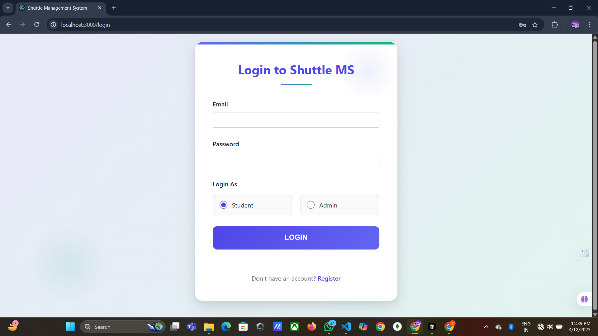

   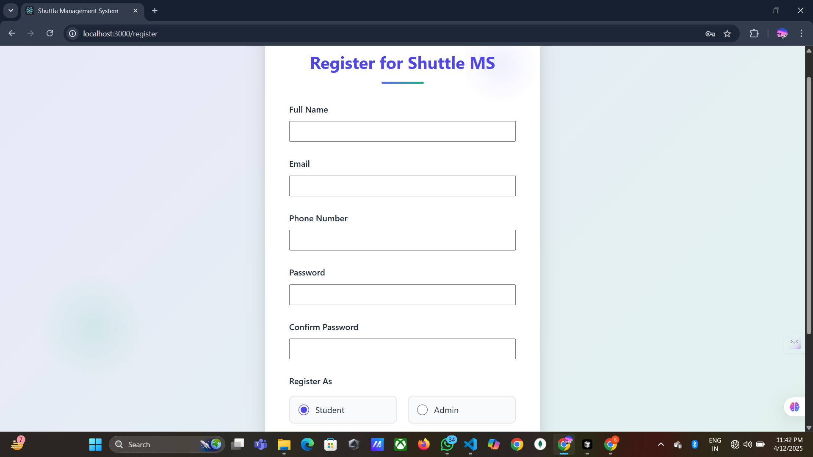


- **Dashboard**: Overview of available shuttles and quick actions

   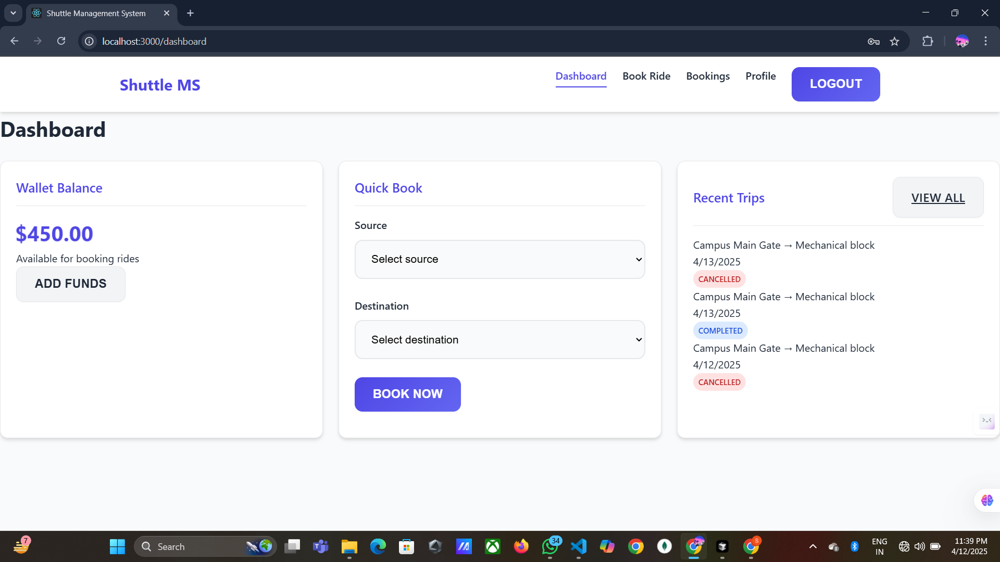

   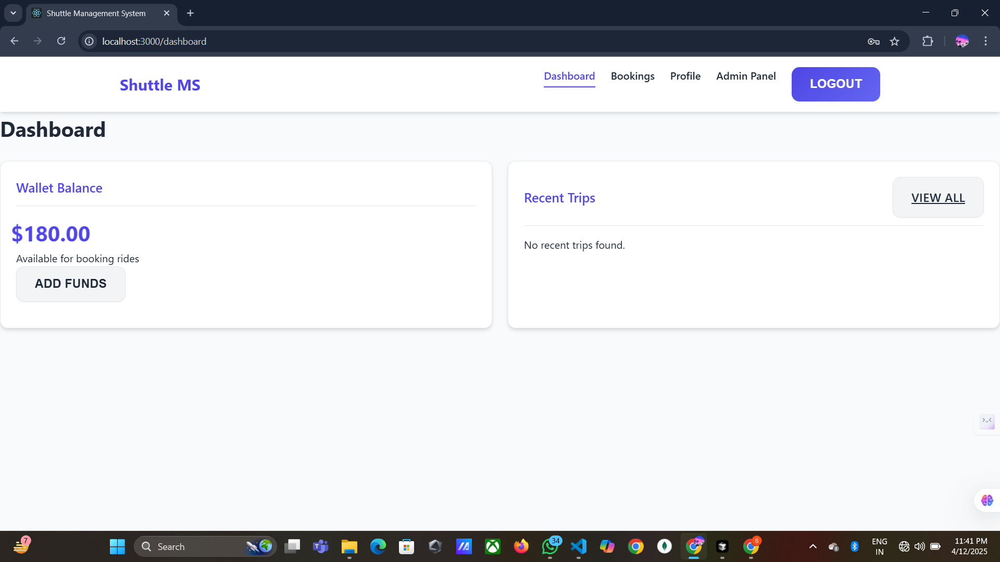

- **Book a Ride**: Select routes and book shuttle rides using wallet points

 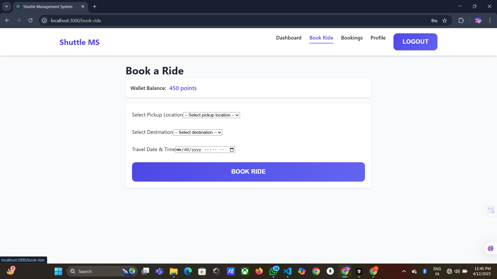
- **Trip History**: View past and upcoming shuttle bookings

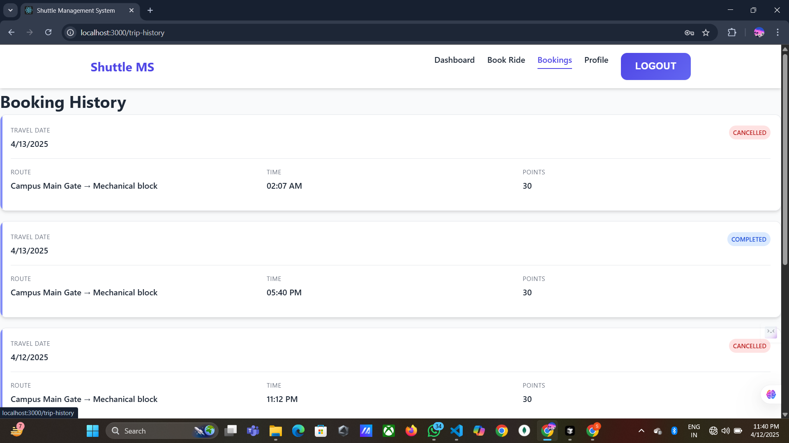
- **Wallet System**: Manage and track point balance and transaction history

- **User Profile**: View and manage personal information

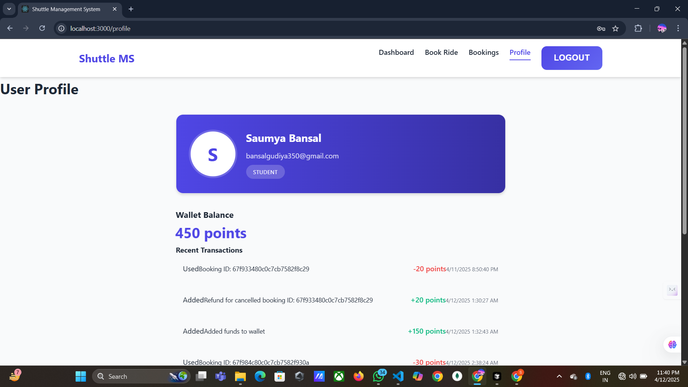

### Admin Features
- **Admin Dashboard**: Overview of system statistics and activities


- **Manage Students**: Add, edit, and manage student accounts

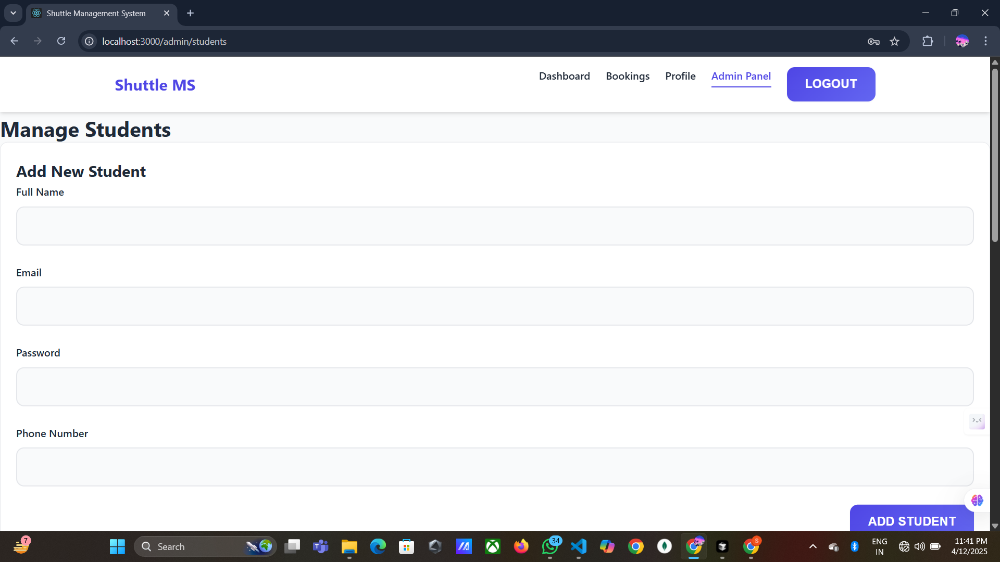
- **Manage Routes**: Create and modify shuttle routes

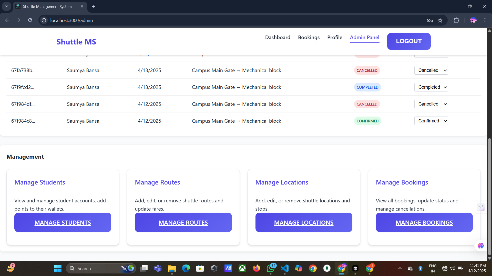
- **Manage Bookings**: Track and manage all shuttle bookings

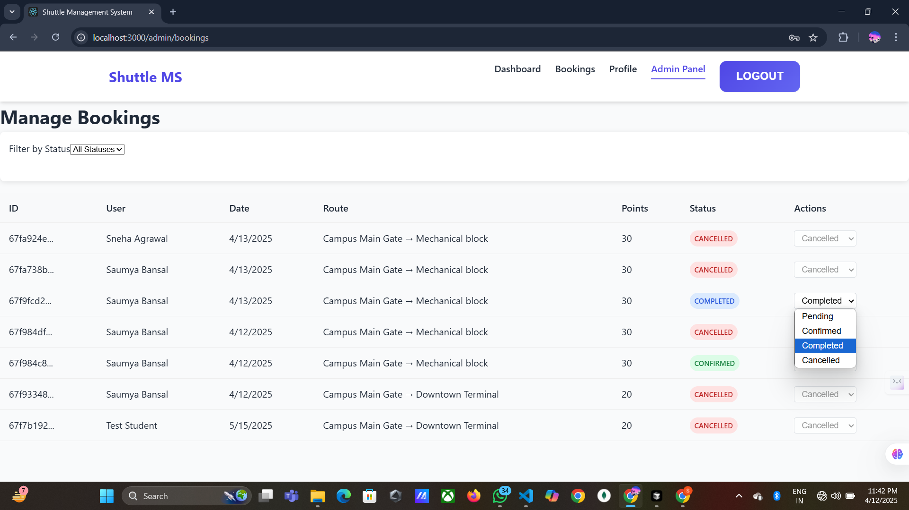
- **Manage Locations**: Add and edit pickup/drop-off locations

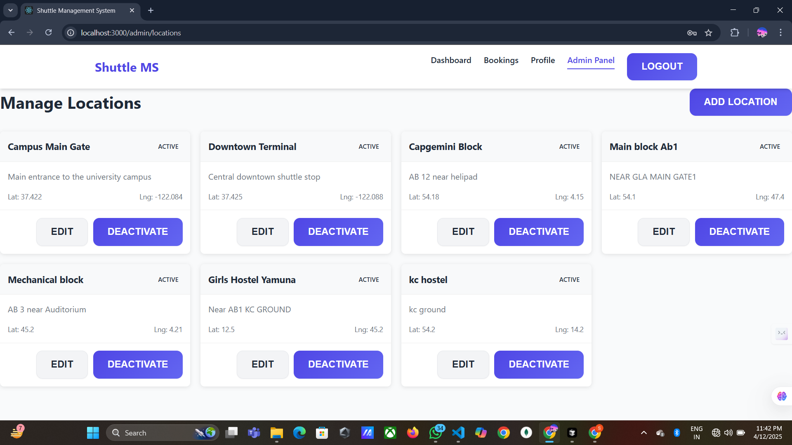

## Technology Stack

### Frontend
- **React.js**: Component-based UI development
- **React Router**: For navigation between different views
- **Axios**: For API requests
- **CSS**: Custom styling for components

### Backend
- **Node.js**: JavaScript runtime
- **Express.js**: Web application framework
- **MongoDB**: NoSQL database
- **Mongoose**: Object Data Modeling (ODM) library
- **JWT**: JSON Web Tokens for authentication

## Project Structure

```
shuttle/
├── frontend/              # React frontend application
│   ├── public/            # Static files
│   └── src/               # Source files
│       ├── components/    # Reusable UI components
│       ├── pages/         # Page components
│       ├── services/      # API services
│       └── index.js       # Entry point
│
├── backend/               # Node.js backend application
│   ├── config/            # Configuration files
│   ├── controllers/       # Request handlers
│   ├── middleware/        # Custom middleware
│   ├── models/            # Database models
│   ├── routes/            # API routes
│   └── server.js          # Server entry point
```

## Getting Started

### Prerequisites
- Node.js (v14 or higher)
- MongoDB
- npm or yarn

### Installation

1. Clone the repository
```bash
git clone <repository-url>
cd shuttle
```

2. Install backend dependencies
```bash
cd backend
npm install
```

3. Install frontend dependencies
```bash
cd ../frontend
npm install
```

4. Create a .env file in the backend directory with the following variables:
```
PORT=5000
MONGODB_URI=mongodb://localhost:27017/shuttle-management
JWT_SECRET=your_jwt_secret_key_here
```

### Running the Application

1. Start the backend server
```bash
cd backend
npm start
```

2. Start the frontend development server
```bash
cd frontend
npm start
```

3. Access the application at http://localhost:3000

## API Endpoints

### Authentication
- `POST /api/auth/register` - Register a new user
- `POST /api/auth/login` - Login a user

### User
- `GET /api/users/profile` - Get user profile
- `PUT /api/users/profile` - Update user profile

### Wallet
- `GET /api/wallet/balance` - Get wallet balance
- `GET /api/wallet/transactions` - Get transaction history

### Bookings
- `POST /api/shuttles/book` - Book a shuttle
- `GET /api/shuttles/bookings` - Get user bookings
- `PUT /api/shuttles/bookings/:id/cancel` - Cancel a booking

### Admin
- `GET /api/admin/dashboard` - Get admin dashboard stats
- `GET /api/admin/users` - Get all users
- `PUT /api/admin/users/:userId` - Update a user
- `POST /api/admin/users/:userId/points` - Add points to a user
- `GET /api/admin/bookings` - Get all bookings
- `PUT /api/admin/bookings/:id/status` - Update booking status

## Contributors

- [Your Name](https://github.com/yourusername) - Project Lead

## License

This project is licensed under the MIT License - see the LICENSE file for details.

## Acknowledgments

- [React Documentation](https://reactjs.org/docs)
- [Express Documentation](https://expressjs.com/)
- [MongoDB Documentation](https://docs.mongodb.com/) 